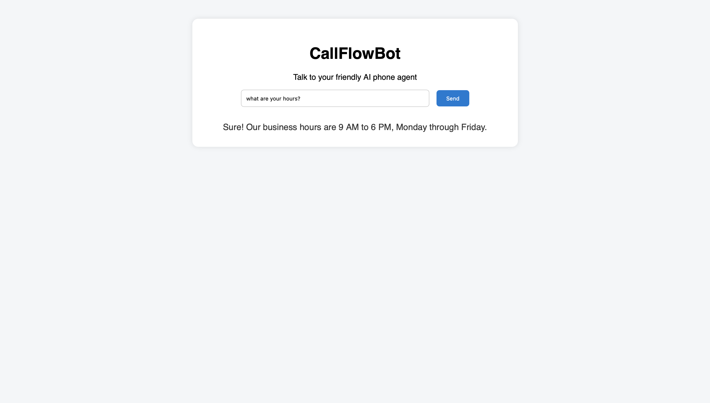
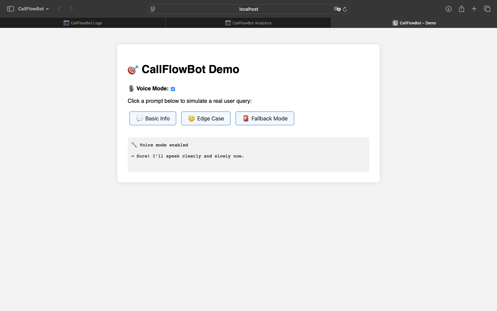
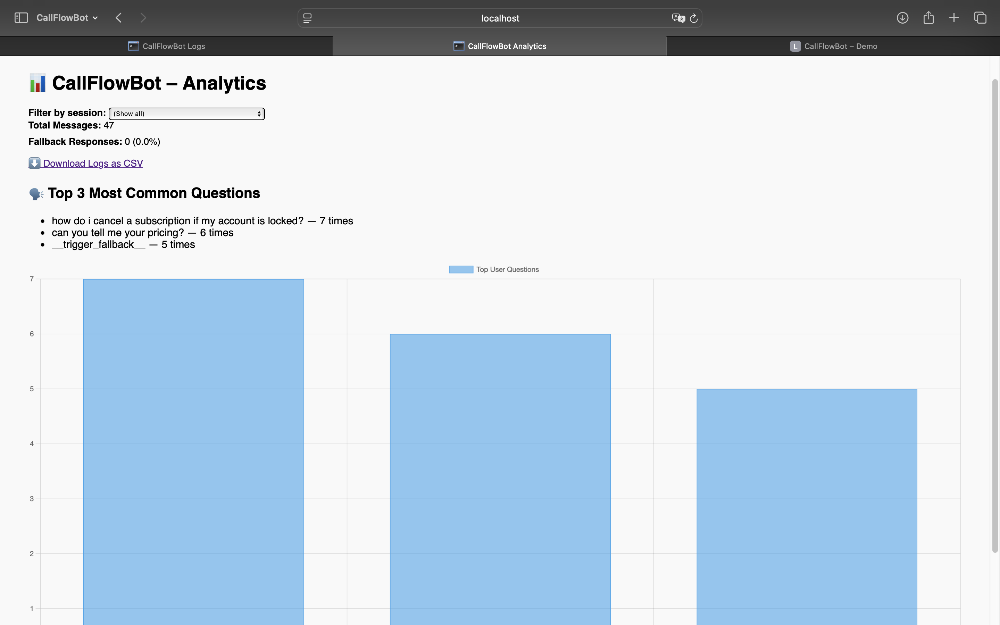
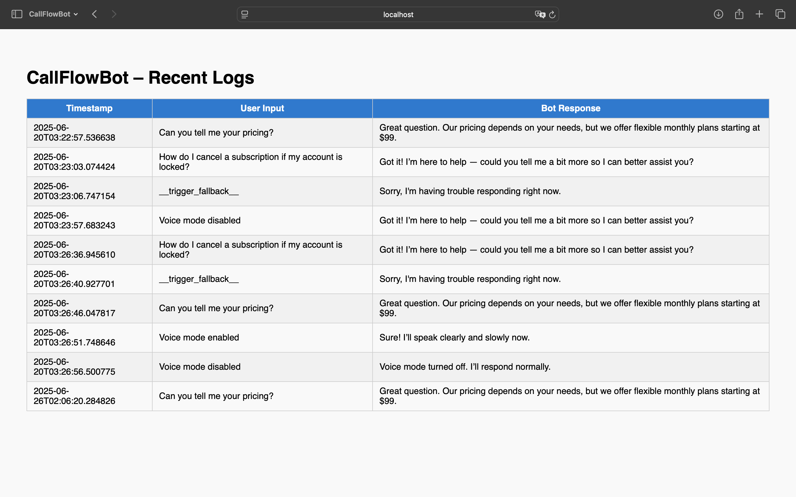

# 📞 CallFlowBot


**CallFlowBot** is a full-stack simulated AI call agent demo built with Flask, OpenAI API, and a modular web UI. It mimics Twilio webhook interactions, provides LLM-style responses with fallback logic, logs user sessions, and includes analytics + demo tooling — now live and fully deployable.

### 🔗 [Live Demo](https://callflowbot.onrender.com/demo)

---

## 🌟 Try It With:
> “Can you tell me your pricing?”  
> “How do I cancel my subscription?”  
> “Thank you.”  
> Or toggle Voice Mode 🎙️ to simulate tone switching.

---

## 🧠 What It Does

- Accepts user input via UI or POST to `/twilio-webhook`
- Responds using OpenAI GPT-3.5 — or scripted fallback logic
- Tracks unique `session_id` per user
- Logs all messages + bot responses to `.json`
- Shows analytics dashboard (`/dashboard`)
- Features a live `/logs` viewer
- Full interactive demo with scripted buttons and toggles

---

## 💻 Tech Stack

- **Flask** for backend + routes
- **HTML / JS / CSS** frontend
- **OpenAI API** (or fallback logic)
- **JSON logging** per session
- **Chart.js** for live analytics
- **Render** for deployment

---

## 🚀 Features by Phase

| Phase  | Description                                           |
|--------|-------------------------------------------------------|
| `v1.0` | Scripted backend logic for basic AI simulation        |
| `v1.1` | OpenAI integration with fallback support              |
| `v2.0` | Web UI with dynamic input + bot replies               |
| `v3.0` | `.json` log output system                             |
| `v4.0` | Live deployment to Render                             |
| `v5.0` | `/logs` viewer route with interaction table           |
| `v6.0` | `/dashboard` with fallback % and top user questions   |
| `v6.5` | Bar chart + CSV download from dashboard               |
| `v7.0` | Session filtering + per-user stats                    |
| `v8.0` | Interactive demo page with one-click prompts          |
| `v9.0` | Voice mode toggle + frontend polish                   |

---

## 🌁 Preview


[](https://callflowbot.onrender.com/chat)
[](https://callflowbot.onrender.com/demo)
[](https://callflowbot.onrender.com/analytics)
[](https://callflowbot.onrender.com/logs)


---

## 📜 How to Run Locally

```bash
git clone https://github.com/AndreaZaragoza/CallFlowBot.git
cd CallFlowBot

# Create a .env file with your OpenAI key
echo "OPENAI_API_KEY=sk-..." > .env

pip install -r requirements.txt
python app.py
```

Visit [http://localhost:5001/chat](http://localhost:5001/chat)

---

## 📂 Sample API Call

```bash
curl -X POST http://localhost:5001/twilio-webhook \
-H "Content-Type: application/json" \
-d '{"transcript": "Can you tell me your pricing?"}'
```

---

## 🔮 Future Ideas

* Voice-to-text or Twilio integration (real call flow)
* Agent sentiment tracking
* Admin panel with filters + user activity
* Export logs by session

